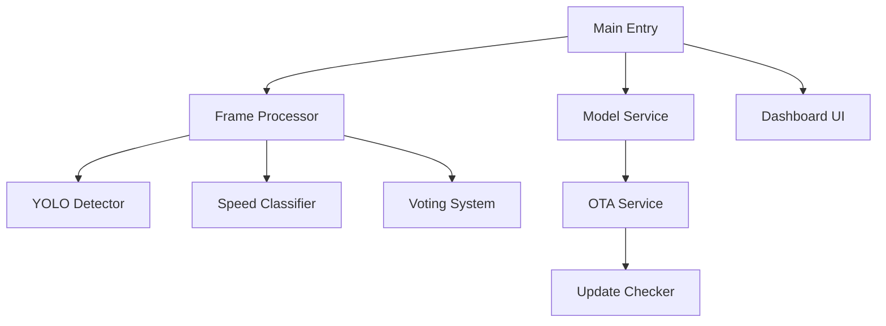

# Savina Assistant - Hệ thống Nhận diện Biển báo Giao thông (TSR)

Assistant là một giải pháp hỗ trợ lái xe thông minh, sử dụng AI để nhận diện và phân loại biển báo giao thông thời gian thực. Hệ thống được tối ưu hóa cho hiệu suất cao trên các thiết bị Edge và cung cấp giao diện điều khiển trực quan.

## Kiến trúc Hệ thống



## Tính Năng Cốt Lõi

### 1. Engine Nhận diện Mạnh mẽ
- **YOLO Detector**: Sử dụng mô hình YOLOv8 tối ưu cho tốc độ và độ chính xác.
- **Speed Classifier (P.127)**: Tự động kích hoạt mô hình phân loại phụ khi phát hiện biển báo giới hạn tốc độ (P.127) để xác định con số cụ thể.
- **Voting System**: Cơ chế bỏ phiếu đa khung hình giúp loại bỏ các kết quả nhận diện sai và đảm bảo độ ổn định của output.

### 2. Quản lý Model & Cập nhật (OTA)
- **Hot-reload**: Chuyển đổi giữa các mô hình (8n-14k.pt, best.pt, ...) ngay khi ứng dụng đang chạy.
- **OTA Portal**: Tự động kiểm tra phiên bản, tải xuống và xác thực MD5 checksum cho các mô hình mới từ server.
- **Update Checker**: Hệ thống thông báo khi có phiên bản phần mềm mới.

### 3. Interactive Dashboard
- Giao diện trực quan hiển thị luồng video, kết quả nhận diện và các chỉ số thống kê (FPS, Processing Time).
- Cho phép bật/tắt các loại biển báo cần theo dõi ngay trên UI.

---

## Cấu Trúc Thư Mục

- `config/`: Chứa hằng số toàn cục và quản lý cấu hình (persistence).
- `core/`: Engine xử lý khung hình, detector, classifier và logic voting.
- `services/`: Các dịch vụ nền như OTA, Model Service và Update Checker.
- `ui/`: Giao diện Dashboard sử dụng OpenCV.
- `utils/`: Các công cụ hỗ trợ về logging, network và xử lý file.
- `models/`: Thư mục lưu trữ các file mô hình (.pt, .pth).

---

## Cài Đặt & Sử Dụng

### Yêu Cầu Hệ Thống
- Python 3.8+
- Cài đặt phụ thuộc: `pip install -r requirements.txt`

### Lệnh Chạy Ứng Dụng
```bash
# Chạy với Camera mặc định
python main.py --camera 0

# Phân tích file video
python main.py --video path/to/video.mp4

# Sử dụng model cụ thể
python main.py --model 8-22k.pt --camera 0

# Các lệnh quản lý
python main.py --list-models    # Xem danh sách model hiện có
python main.py --check-update   # Kiểm tra cập nhật phần mềm
```

### Phím Tắt Dashboard
- `W / S`: Di chuyển lên/xuống trong danh sách biển báo (Detect Classes).
- `SPACE`: Bật/Tắt (Toggle) việc nhận diện loại biển báo đang chọn.
- `Q`: Thoát ứng dụng.

---

## Cấu Hình (settings.json)

Hệ thống tự động tạo file `settings.json` cho phép tùy chỉnh:
- `ota`: Server URL, API Key và chế độ tự động cập nhật.
- `detection`: Model mặc định, giới hạn FPS (tối ưu hóa thiết bị yếu), kích thước ảnh đầu vào và ngưỡng tin cậy (Confidence).

---
*Savina Assistant - An tâm trên mọi hành trình.*